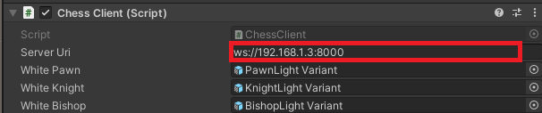

# HoloChess

A futuristic cross-platform multi-player chess game. Players face off against eachother or versus AI from a local PC, web browser, or wearing an AR/VR headset to interact with the game board in augmented reality.

# Installation

Create a virtual environment and use the package manager [pip](https://pip.pypa.io/en/stable/) to install the dependencies.

```bash
# Create the virtual environment
python3 -m venv venv

# Activate the virtual environment
.\venv\Scripts\activate.bat # on Windows
. venv/bin/activate # on macOS/Linux

# Install the dependencies
pip3 install -r requirements.txt
```

## Usage

Run the game server:

```bash
python game-server.py
```

Open the Unity project and point the chess client to your server's host IP or domain:



Deploy and run the Unity client on your head-mounted device.

## Server

The game server runs as a python process listening for WebSocket connections.
It includes simple "first-come-first-serve" matchmaking to pair up players waiting in the lobby for a match.

## Clients

List of clients available at this time:

  - Unity AR/VR Client (HoloLens, Oculus Quest)
  - Python Client (CLI)
  - Web Client (in-browser GUI)
  - Stockfish (AI chess engine)